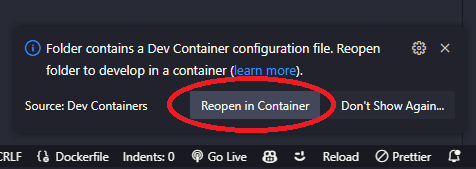

# Proposito do documento
Este documento tem como objetivo fornecer uma visão geral de como executar o VS Code para desenvolvimento em Python com o Docker.

Vamos considerar que você esta usando o nosso template de projeto. E que você já leu o documento [01-instalação-docker.md](01-instalação-docker.md) e [02-preparando-docker-para-python.md](02-preparando-docker-para-python.md) e configurou corretamente, com todas as dependências, o arquivo `requirements.txt`. E com isso você já tem o ambiente Docker configurado.

Entendemos que você já tenha instalado o VS Code. Caso ainda não tenha, você pode fazer o download e a instalação [aqui](https://code.visualstudio.com/download).

Agora vamos seguir os passos para finalizar a configuração do VS Code e iniciar o desenvolvimento em Python com o Docker.

## Passo 1: Abrir o VS Code

1. Abra o VS Code em sua máquina.

## Passo 2: Instalação de extensões
1. Abra a paleta de comandos (Ctrl+Shift+P ou Cmd+Shift+P no macOS) e digite "Extensions: Install Extension".
  - Ou você pode clicar no ícone de extensões no lado esquerdo da janela do VS Code. 
  
2. Procure pelas extensões `Docker` e `Dev Containers` e instale-as.
3. Instale também as extensões relevantes para o seu projeto.
4. Reinicie o VS Code.

- **Docker**: Esta extensão permite que você gerencie e execute contêineres Docker diretamente do VS Code.
- **Dev Containers**: Esta extensão permite que você abra um projeto em um contêiner Docker configurado, ela detecta automaticamente o arquivo `devcontainer.json` e configura o ambiente de desenvolvimento.

## Passo 3: Abrir o projeto no VS Code

- **Comesse verificando se o Docker Desktop está rodando. Se não estiver, inicie-o.**

1. Clique em "Arquivo" no menu superior e selecione "Abrir Pasta".
2. Navegue até a pasta do seu projeto e selecione-a.

- O VS Code permite uma variedade de formas de abri a pasta de um projeto, escolha a que for de sua preferência:
  - Abrir a pasta no explorer, clicar com  o botão direito do mouse e selecionar "Abrir com o VS Code"
  - Abrir o terminal de sua preferencia, navegar ate a pasta do projeto e executar o comando `code .`

3. Ao abrir a pasta do projeto, o VS Code irá detectar automaticamente o arquivo `devcontainer.json` e configurar o ambiente de desenvolvimento. Assim que ele terminar de configurar o ambiente, você verá uma mensagem no canto inferior direito da tela, clique em `Reopen in Container`.

4. Após clicar em `Reopen in Container`, o VS Code irá abrir seu projeto em um ambiente configurado e integrado ao Docker.

## Conclusão
Agora você está pronto para começar a desenvolver em Python com o Docker usando o VS Code.
Aproveite, e boa sorte! ☕😋

[Voltar - Exemplo de requirements.txt](./03-exemplos-de-requirements.txt.md)
[Proximo - Comandos Docker e Docker Compose](./05-comandos-docker-e-docker-compose.md)